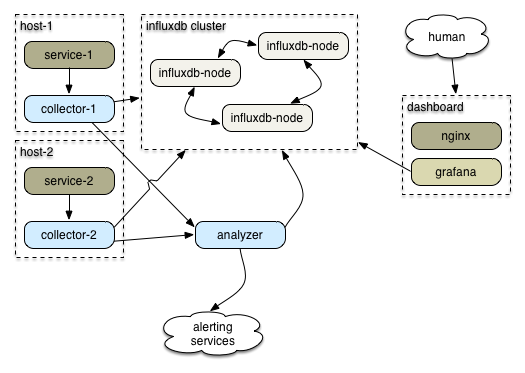

# The numbat system

Numbat-powered metrics are in production at npm, allowing us to gather a lot of metrics from node services and view them in pretty charts.

The numbat modules:

* [numbat-emitter](https://github.com/numbat-metrics/numbat-emitter): a module you're intended to require anywhere you need it. Make an emitter object, then emit metrics with it by calling `process.emit('metric', {name: 'foo'})`.  
* [numbat-collector](https://github.com/numbat-metrics/numbat-collector): receiver that runs on every host  
* [numbat-analyzer](https://github.com/numbat-metrics/numbat-analyzer): a server that accepts data streams from the collector & processes them
* [numbat-influx](https://github.com/numbat-metrics/numbat-influx): an InfluxDB 0.9+ output sink for the collector
* [numbat-redis](https://github.com/numbat-metrics/numbat-redis): emit some interesting redis stats
* [numbat-haproxy](https://github.com/numbat-metrics/numbat-haproxy): watch what your haproxies are up to
* [numbat-process](https://github.com/numbat-metrics/numbat-process): include in your node server to emit periodic stats about it

Design:

- There's a bunch of [InfluxDB](http://influxdb.com)s sharded by hand to balance out usage. (We haven't been happy with it clustered).
- Each host with services to be monitored runs a [numbat-collector](https://github.com/numbat-metrics/numbat-collector) listening on a known tcp port. (You can also use udp or websockets.)
- Each service makes a numbat-emitter client & then emits metrics at will.
- The per-host collectors send all data to InfluxDB and to any other output you have defined.
- They also send it to the [numbat-analyzer](https://github.com/numbat-metrics/numbat-analyzer).
- `numbat-analyzer` analyzes stats & also feeds data to InfluxDB.
- `numbat-analyzer` is also responsible for sending alerts to Pager Duty and to a Slack channel.
- [grafana](http://grafana.org) dashboards show the data.
- If this service does its job, you delete your nagios installation. (Except you don't ever, because you have redundant monitoring and monitoring for the monitoring.)

An example setup might look like this, with many service/collector pairs:



This is what we run in production at npm, only we have over 100 instances running services & sending data in.

### Data flow

Implications:

- everything goes into InfluxDB: metrics, operational actions, other human actions
- Dashboard needs to include both visual data (graphs) & current alert status
- data should probably get tagged with "how to display this" so a new stream of info from numbat can be displayed usefully sans config
- Dashboard should link to the matching Grafana historical data displays for each metric.

### What does a metric data point look like?

It must be a valid InfluxDB data point. Inspired by Riemann's events.

```javascript
{
    host: 'hostname.example.com',
    name: 'name.of.metric',
    status: 'okay' | 'warning' | 'critical' | 'unknown',
    description: 'textual description',
    time: ts-in-ms,
    ttl: ms-to-live,
    value: 42,
    field: 'abitrary data',
    field2: 'another tag'
}
```

Use tags to carry metadata. Some possibilities:

- `annotation`: a singular event, like a deploy.
- `counter`, `gauge`, etc: hints about how to chart

## Contributing

Yes, please. See [contributing.md](contributing.md) for information about how and our code of conduct.
